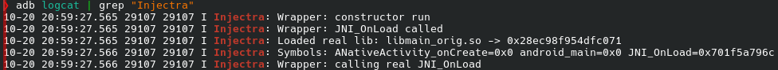
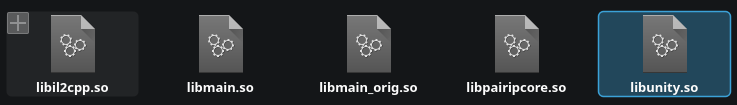

# Injectra mobile

Try making mobile mod loader for terraria, and i have some results. 



To build library, just type `sudo ndk-build` in project folder. Library will be in `libs/` folder.
If you don't have android ndk and sdk, download it like that (for pacman and yay package managers):
```
sudo pacman -S android-tools android-udev
yay -S android-sdk-cmdline-tools-latest
yay -S android-ndk
yay -S android-sdk-platform-tools
```

Platform tools you need to verify apk with key. And yeah, you need to download apktool too: 
```
sudo curl -L -o /usr/local/bin/apktool https://raw.githubusercontent.com/iBotPeaches/Apktool/master/scripts/linux/apktool

sudo curl -L -o /usr/local/bin/apktool.jar https://bitbucket.org/iBotPeaches/apktool/downloads/apktool_2.12.1.jar

sudo chmod +x /usr/local/bin/apktool /usr/local/bin/apktool.jar
```

After that, you need to unpack apk:
```
apktool d /path/to/apk -o Your_folder_name
```

Then, in folder where you unpack terraria, find lib/arm64-v8a, and here rename libmain.so to libmain_orig.so. After that, add libinjectra.so, and rename it like libmain.so. It should be like that:



After you do it all staff, write that

```
apktool b Your_folder_name -o TerrariaMod.apk
```

And you finally get your apk. After that just use debug key to verify apk, and this all!
Type this to create debug key ` keytool -genkey -v -keystore debug.keystore -alias androiddebugkey -keyalg RSA -keysize 2048 -validity 10000`, and after that type this `apksigner sign --ks debug.keystore --ks-key-alias androiddebugkey --out TerrariaMod-signed.apk TerrariaMod.apk` to finally get signed apk. 

Thats all for now!